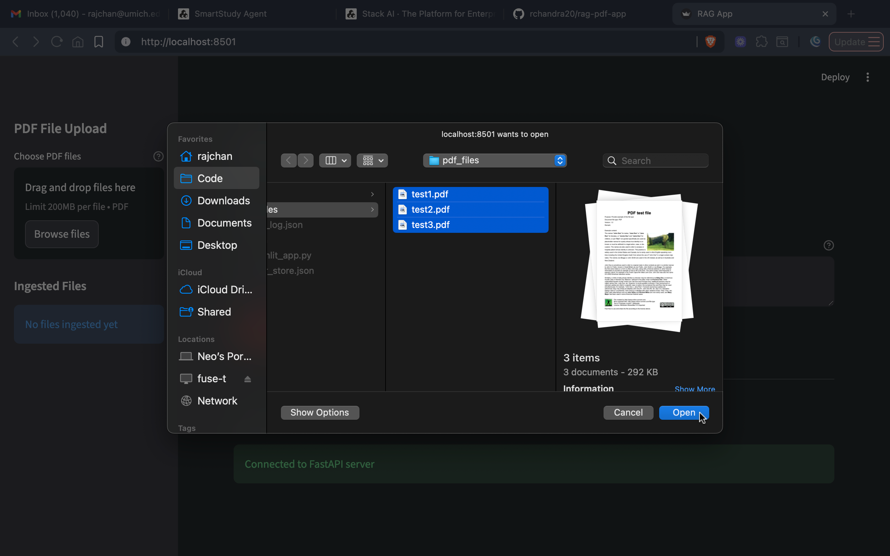
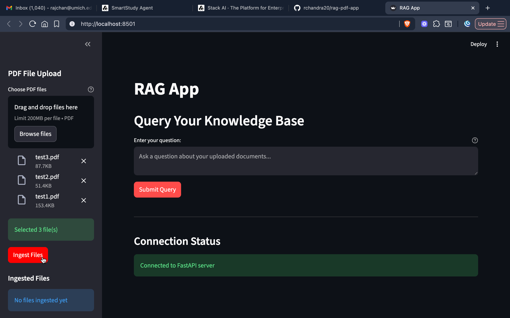
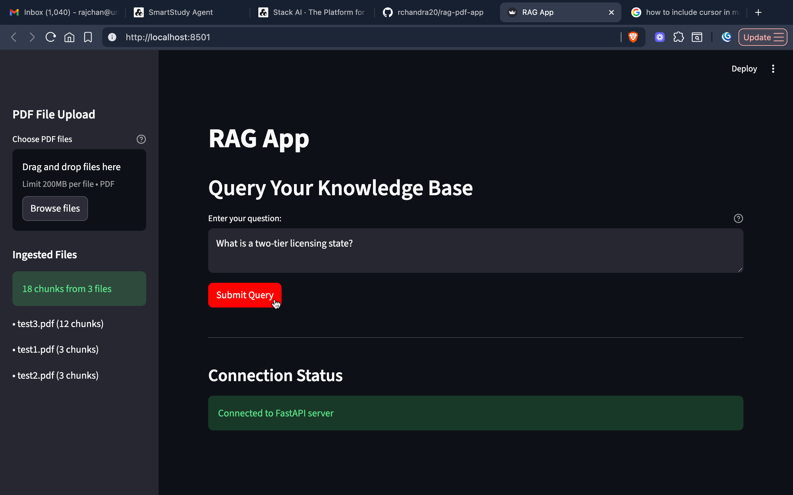

# RAG App

An application for PDF file ingestion and querying with RAG (Retrieval-Augmented Generation).

Tech Stack:
Language -> Python  
Frontend -> Streamlit  
Backend -> FastAPI

Architecture:


## Quick Start


### Step 0: Install libraries in 'requirements.txt'

```bash
pip3 install -r requirements.txt
```

### Step 1: Environment Configuration

Rename the `.env.tpl` file in the `rag_app/` directory to `.env`
```bash
cd rag_app/
mv .env.tpl .env
```
Fill in Mistral_API_Key= with your own unique account key

### Step 2: Run Rag App
```bash
./run.sh
```

This bash script will start both:
- FastAPI server at FASTAPI_URL set in rag_app/.env
- Streamlit UI at STREAMLIT_URL set in rag_app/.env

### Step 3: Navigate to the Streamlit UI on your machine at STREAMLIT_URL

### Step 4: Upload all PDF files present in pdf_files/ through UI

Click 'Browse Files' to select all files


Click 'Ingest Files' to load into vector store


### Step 5: Submit sample queries in UI


Sample Queries:
1. What is a two-tier licensing state?
2. Which countries is 'Doe' used in?
3. Why is value over the long term important?
4. How is customer obsession shown by Amazon?

### Step 6: Observe generated answers! You can use the chunk ids to trace the chunks being used by looking at 'query_log.json'


## Additional Information


### Query Logging

All queries and results made in RAG App can be viewed in 'query_log.json'. This allows for
enhanced traceability as to which chunks are contributing to answer. To clear this query log
run the following command:

```bash
: > query_log.json
```

### Vector Store

File chunks are persisted to 'vector_store.json' upon ingestion. To empty the custom vector
store run the following command:

```bash
: > vector_store.json
```

### Software Library Links
[FastAPI](https://fastapi.tiangolo.com/) - Building backend API endpoints  
[Uvicorn](https://www.uvicorn.org/) - Serving ASGI apps (e.g., FastAPI)  
[Streamlit](https://streamlit.io/)- Interactive frontend apps, dashboards  
[Requests](https://requests.readthedocs.io/en/latest/) - Making HTTP calls from Python  
[PyPDF2](https://pypi.org/project/PyPDF2/) - Extracting text from PDFs
[MistralAI (mistralai)](https://github.com/mistralai/client-python) - Using Mistral AI models (chat/embeddings)  
[python-dotenv](https://pypi.org/project/python-dotenv/) - Loading .env into os.environ  
[python-multipart](https://pypi.org/project/python-multipart/) - Handling file uploads  


### API Usage (Separate Terminal) - Hit FastAPI endpoints directly

```bash
cd rag_app/
export FASTAPI_URL=http://localhost:8000
```

**Ingest files:**
```bash
curl -X POST "${FASTAPI_URL}/ingest/" \
  -F "files=@pdf_files/test1.pdf" \
  -F "files=@pdf_files/test2.pdf"
```

**Query the knowledge base:**
```bash
curl -X POST "${FASTAPI_URL}/query/" \
  -H "Content-Type: application/x-www-form-urlencoded" \
  -d "question=What is a two-tier licensing state"
```